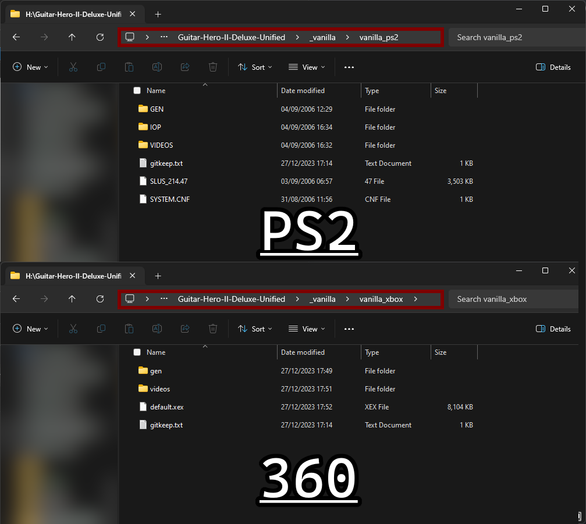

# Guitar Hero II Deluxe: Unified

## This is currently in *pre-alpha*.

# Prerequisites
You will need NTSC-U copies of Guitar Hero 2 on both Xbox 360 and PS2. These steps are needed to initialize or to fix any major issues with the repo.
- Copy extracted PS2 contents to `_vanilla/vanilla_ps2`.
- Copy extracted Xbox 360 contents to `_vanilla/vanilla_xbox`.

- Run `_01_extract_vanilla_games.bat`. which will extract the game file contents of both vanilla games.
- Run `_02_build_ps2_vanilla.bat`.
- Run `_03_build_xbox_vanilla.bat`.

# Building
- Run `build_xbox.bat` to build Xbox.
- Run `build_ps2.bat` to build PS2.