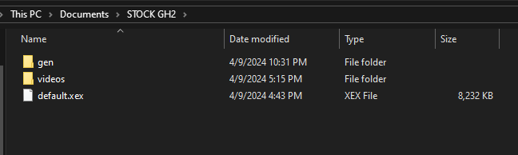

# Guitar Hero II Deluxe: Unified

## Welcome to the Future of GH2DX!!!

##THIS MOD IS *IN* PRE-ALPHA, EXPECT BUGS AND PS2 TO NOT WORK

#BACKGROUND:
	For a good ammount of time, GH2DX360 was far too unstable, notable issues were that of the score meter having the score be out of allignment,
campaign mode was broken, same for the more stats screen, and far to many more to get into here. TL;DR GH2DX360 was inherently Broken, and while many 
features were beneficial to GH2DX360 (Custom highway textures, color themes, PoorSpy ETC.), it was determined that it would be better for the project
as a whole if the entierty of GH2DX's code was re-written with the knowledge Milohax has gained from the many other DX projects (Play Rock Band 3 Deluxe).
GH2DX Unified (GH2DXu) is in a manner of speaking a "Remastered" version of GH2DX 1.0 so far, and while the current discussion has been focused on just 
the 360 edition, PS2 will be recieving the same treatment to bring full parity to GH2DX for once and all...

#INSTALLATION:
	-GH2DXu is in PRE-ALPHA, so the install process is *subject to change*. Currently there is 2 flavors of GH2DXu, PS2 and Xbox-360.

#XBOX 360
	-GH2DXu for Xbox-360 WILL require the following:
	-Python
	-Access to a CMD prompt
	-A "legally" aquired copy of stock GH2 for the Xbox-360.

	-1. ENSURE YOUR COPY OF GH2 IS IN A RAW-FILE FORMAT (Refer to the picture below)

	-2. Take your GH2 Raw Files and Place them within `Guitar-Hero-II-Deluxe-Unified\platform\xbox` (it should look like the picture below, DO NOT DELETE ANYTHING
ALREADY IN THE FOLDER)

	-3. Now this is the CMD prompt bit comes in: Open a CMD prompt (does not matter where the prompt is pointed, just run it as admin)
ENSURE YOU RUN THIS COMMAND LETTER FOR LETTER: `pip install pillow` 
	-4. Once it is installed, located the `scripts` folder in the root of the Repository, in this folder run `build_xbox.bat`. A CMD prompt will now open.
	-5. Upon completion of the creation of the DX patch, a new folder called `out` should have opened, you now have offically survived the process of creating
your very own copy of GH2DXu for the Xbox-360! Congrats!
	-6. Now here is the easy part, you remember that copy of stock GH2 you legally aquired, well make a copy of those files, and in this new copy of GH2
simply drag the newly created `GEN` and `default.xex` files/folders (for those who prefer their GH2 with overscan you can rename `default no overscan.xex` to 
default.xex after getting rid of the OG default.xex) over to your copy of stock GH2.
	-7. You have offically created your own GH2DXu copy. Now you can use this copy of GH2DXu on any platform where 360 Games can be ran
	
		-PRO-TIPS: If you still have a original version of GH2DX360 on your PC, you can use that to get a good install of XENIA, the XBOX-360 Emulator :).
			   GH2DXu also has ALL of the Xbox-360 setlist, so no need to install anymore custom GH2DLC packs!

##THIS MOD IS *IN* PRE-ALPHA, EXPECT BUGS AND PS2 TO NOT WORK

#Playstation 2
	-GH2DXu for PS2 WILL require the following:
	-Python
	-Access to a CMD prompt
	-A "Legally" aquired copy of stock GH2 for the Playstation 2
	-ImgBurn (any other tool that lets you make a ISO from a folder will work, but will not apply to the following instructions)

	-1. Extract your copy of GH2 from its ISO (Disc Image file) container. The files should be in a folder that looks like this:

	-2. Place your newly extracted copy of GH2 PS2 into `Guitar-Hero-II-Deluxe-Unified\platform\ps2' (it should look like the picture below, DO NOT DELETE ANYTHING
ALREADY IN THE FOLDER)

	-3. Now this is the part where the CMD prompt bit comes in: Open a CMD prompt (does not matter where the prompt is pointed, just run it as admin)
ENSURE YOU RUN THIS COMMAND LETTER FOR LETTER: `pip install pillow` 
	-4. Once it is installed, located the `scripts` folder in the root of the Repository, in this folder run `build_xbox.bat`. A CMD prompt will now open.
	-5. Upon completion of the creation of the DX patch, a new folder called `out` should have opened, you now have offically survived the process of creating
your very own copy of GH2DXu for the Playstation 2! Congrats!
	-6. Now just copy the contents of the `out` folder into your stock GH2 copy... BOOM GH2DXu PS2 Has now been born.
	-7. Now here is the annoying part... you have to create your own ISO for the game... now this is going to be really annoying, but I REALLY do recommend getting
familar with this for later down the line when GH2DXu gets far enough in dev to allow for customs (if your from the future where this happens, ignore that last bit).
now time to familarlize your self with ImgBurn... I know it looks intimdating but just follow and do as I say.
	-8. Click on the `Create image from files/folders` option, here you are then going to click on the little folder icon in the middle of the large blank box.
Then in the new window, select the folder where you have copied your GH2DXu patch into your Stock GH2 folder.
	-9. Click on the folder icon below the previous one, now you just select where the ISO will output, all in all, your ImgBurn window will look like this:

	-10. Click the Folder->Img button.... Thats all.... your freshly baked GH2DXu ISO is now ready to play! You survived ImgBurn!
	-11. Now for the real fun, GH2DXu works wherever PS2 games do! (well it would... once it gets updated, yeah, sadly the PS2 version is yet working properly,
thankfully it should be fixed soon and these instructions will actually be useful)

##THIS MOD IS *IN* PRE-ALPHA, EXPECT BUGS AND PS2 TO NOT WORK